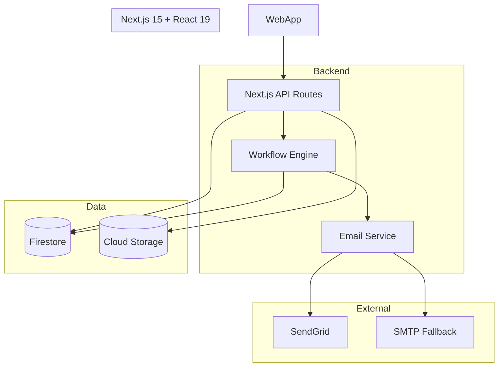
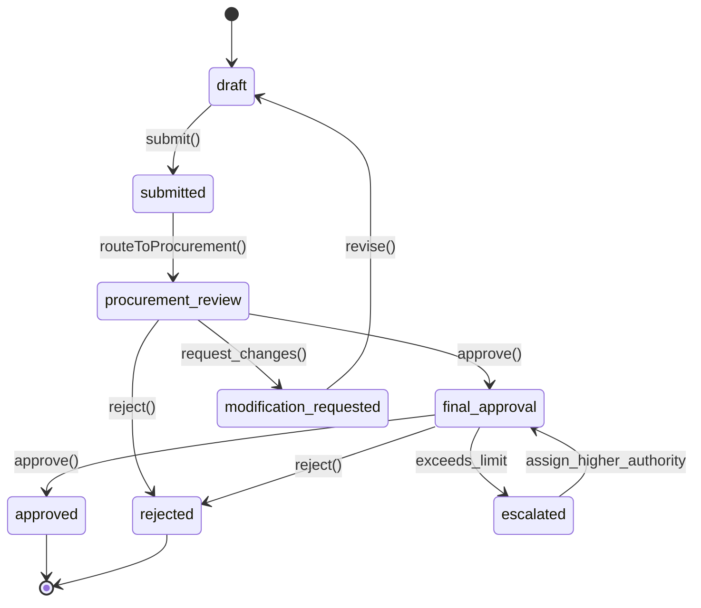

# 1PWR Procurement Requisition System
## Product Requirements Document (PRD) v2.0

**Document Version:** 2.0  
**Last Updated:** December 2024  
**Project Code:** 1PWR-PRS  
**Classification:** Internal Use  
**Document Status:** ✅ **ACTIVE - FOUNDATIONAL**

---

## 📋 Document Cross-References

This PRD is the central product specification that links with all foundational documents:

### 🔗 Core Documentation Links
- **[CLAUDE.md](./CLAUDE.md)** - AI-First Development Guide & Communication Framework
- **[Blueprint-II.md](./documentation/blueprint-II.md)** - Technical Architecture & System Design
- **[Project Manifest](./.simone/00_PROJECT_MANIFEST.md)** - Complete Project Overview & Status

### 🔗 Kiro Specs Integration
- **[1PWR Procurement Super Spec](./.kiro/specs/1pwr-procurement-super-spec/)** - Implementation specifications
  - [Requirements](./.kiro/specs/1pwr-procurement-super-spec/requirements.md)
  - [Design](./.kiro/specs/1pwr-procurement-super-spec/design.md) 
  - [Tasks](./.kiro/specs/1pwr-procurement-super-spec/tasks.md)

### 🔗 Steering Documents
- **[Architecture Steering](./.kiro/steering/architecture.md)** - Technical guidance
- **[Product Steering](./.kiro/steering/product.md)** - Product guidance
- **[Tech Steering](./.kiro/steering/tech.md)** - Technology guidance

### 🔗 Supporting Documentation
- **[Role-Based Access Control](./documentation/role-based-access-control.md)** - Security & permissions
- **[Reference Data Management](./documentation/reference-data-management.md)** - Data management
- **[Firebase Setup Guide](./documentation/firebase-setup-guide.md)** - Infrastructure setup

---

## 1. Product Overview

The 1PWR Procurement Requisition (PR) System is a next-generation, AI-augmented web platform designed to streamline, automate, and secure purchase request workflows for 1PWR LESOTHO and future multi-tenant organizations. The product provides a seamless, highly available, and compliant solution for all procurement lifecycle stages, leveraging a modern tech stack (Next.js 15, Firebase, TypeScript, and more).

---

## 2. Objectives & Goals

- **Digitize and automate** all PR processes, eliminating paper/manual bottlenecks.
- **Ensure compliance and auditability** for all procurement activities.
- **Support multi-organizational/tenant expansion** from the outset.
- **Empower users** with real-time visibility and actionable analytics.
- **Enhance development velocity and quality** with AI-assisted best practices.

---

## 3. Stakeholders

| Stakeholder                | Role/Interest                                             |
|----------------------------|-----------------------------------------------------------|
| Procurement Team           | Oversight, compliance, process efficiency                |
| Requesters (Employees)     | Submit, track, and manage purchase requests              |
| Approvers (Managers)       | Review and approve/reject PRs                            |
| System Admins              | Manage users, roles, and reference data                  |
| IT/Engineering             | System maintenance, integrations, data security          |
| Finance                    | Budget tracking, audit, reporting                        |
| Executive Leadership       | Spend analytics, compliance, business decisions          |
| Future External Tenants    | Multi-organization readiness                             |

---

## 4. High-Level Features

### 4.1 Core PR Workflow Management
- Multi-step PR creation: line items, attachments, validation.
- **Single, simplified approval workflow (default template):**
  - Stage 1: Procurement review (mandatory).
  - Stage 2: Final approval by an authorized approver; escalate if above authority limit.
  - All PRs follow this same approval flow.
- In-app and email notifications for all key events.
- Robust audit trails for every action.

### 4.2 Authentication & Authorization
- Firebase Auth (email/password, MFA).
- Role-based access: Requester, Approver, Admin, Viewer.
- Secure session management and password recovery.

### 4.3 Reference Data Management  
- CRUD and bulk import/export for departments, vendors, currencies, etc.
- Immediate system-wide propagation and historical preservation.
- **Sample reference data (see Section 6.4 below).**

### 4.4 Real-Time Dashboards & Analytics
- Personalized dashboards by role.
- Real-time progress/status, spend, and workflow analytics.
- Exportable reports and audit data.

### 4.5 Modern Responsive UI/UX
- Mobile-first, accessible, branded interface.
- Form validation, friendly error handling, and smooth transitions.

### 4.6 Advanced Notification System
- Templated, multi-provider email delivery with fallback.
- In-app notifications, user preferences, and delivery logging.

### 4.7 Multi-Tenancy & Scalability
- Data isolation by organization.
- Org-specific configuration and branding.
- Designed for 100+ concurrent users.

### 4.8 AI-Augmented Development & Insights
- AI-assisted coding, documentation, and code reviews.
- Predictive spend analytics, intelligent form suggestions, anomaly detection.

### 4.9 Testing, Security, and Compliance
- 80%+ code coverage, automated E2E and accessibility tests.
- Comprehensive audit logging, encryption, and compliance (GDPR/CCPA ready).

---

## 5. User Stories & Acceptance Criteria

### 5.1 Example Flow (Visual)
![Screenshot 2025-08-14 at 9.33.35 PM.png]

### 5.2 Key User Stories  

| As a...         | I want to...                                   | So that...                       | Acceptance Criteria Example           |
|-----------------|------------------------------------------------|----------------------------------|---------------------------------------|
| Requester       | Create, submit, and track PRs                  | I can order goods/services       | Multi-step PR wizard, status tracking|
| Procurement     | Review and approve/reject PRs                  | Ensure compliance                | Approval UI, workflow logic, audit   |
| Approver        | Approve PRs within my authority                | Enforce budget/approval limits   | Authority checks, escalation         |
| Admin           | Manage users, roles, reference data            | System is accurate and up to date| CRUD for all reference data          |
| All users       | Get real-time updates and analytics            | Make faster, informed decisions  | Dashboards, notifications            |

---

## 6. Visual Aids & Reference Data

### 6.1 System Architecture



### 6.2 Firestore Data Model (Tabular)

| Path                                                        | Type         | Parent                       | Description                        |
|-------------------------------------------------------------|--------------|------------------------------|------------------------------------| 
| organizations                                               | Collection   | root                         | All organizations                  |
| organizations/{orgId}/purchase-requests                     | Collection   | organizations/{orgId}        | PRs per org                        |
| .../{prId}/lineItems                                        | Collection   | purchase-requests/{prId}     | Line items for PR                  |
| .../{prId}/history                                          | Collection   | purchase-requests/{prId}     | PR workflow history                |
| organizations/{orgId}/users                                 | Collection   | organizations/{orgId}        | Users                              |
| organizations/{orgId}/workflowTemplate                      | Document     | organizations/{orgId}        | The single default workflow template|
| organizations/{orgId}/workflowTemplate/steps                | Collection   | workflowTemplate             | Steps in default workflow          |
| organizations/{orgId}/workflowTemplate/steps/{stepId}/assignments | Collection| steps/{stepId}               | Approval assignments               |
| organizations/{orgId}/workflowInstances                     | Collection   | organizations/{orgId}        | Workflow state tracking            |
| .../{instanceId}/approvalChain                              | Collection   | workflowInstances/{instanceId}| Approval escalation chain          |
| organizations/{orgId}/departments, vendors, etc.            | Collection   | organizations/{orgId}        | Reference data                     |
| organizations/{orgId}/auditLogs, emailLogs, systemLogs      | Collection   | organizations/{orgId}        | Audit and system logs              |

### 6.3 Simplified PR Approval State Machine



_All PRs use this single approval workflow for all organizations._

### 6.4 Reference Data Examples

#### Organizations
| Organization       | Active |
|--------------------|--------|
| SMP                | Y      |
| 1PWR LESOTHO       | Y      |
| PUECO LESOTHO      | Y      |
| NEO1               | Y      |
| 1PWR BENIN         | Y      |
| 1PWR ZAMBIA        | N      |
| PUECO BENIN        | N      |

#### Departments 
| Department/Unit                                 | Code         | Active |
|-------------------------------------------------|--------------|--------|
| Executive Leadership                            | -            | Y      |
| Systems Engineering (New Thrust)                | SE           | Y      |
| Reticulation (Retic)                            | RETIC        | Y      |
| Facilities                                      | FAC          | Y      |
| Fleet                                           | FLEET        | Y      |
| Operations & Maintenance (O&M)                  | OM           | Y      |
| Environmental Health & Safety (EHS)             | EHS          | Y      |
| Production                                      | PROD         | Y      |
| Project Management (PMO)                        | PMO          | Y      |
| Electrical Engineering                          | EE           | Y      |
| Mechanical Engineering                          | ME           | Y      |
| Finance, Admin, OSP (Operations Support Platform)| FIN_ADMIN_OSP| Y      |
| HR                                              | HR           | Y      |
| PUECO (Productive Use and Enterprise Co-dev)    | PUECO        | Y      |
| Procurement                                     | PROC         | Y      |

#### Vendors
| ID     | Name              | Preferred | Contact Person     |
|--------|-------------------|-----------|--------------------| 
| VEND01 | Lesotho Supplies  | TRUE      | John Mokoena       |
| VEND02 | Afritech          | FALSE     | Naledi Nthloana    |
| VEND03 | OfficeExpress     | TRUE      | Peter Mphoso       |
| VEND04 | SuperTrucks Ltd   | FALSE     | Mpho Khumalo       |
| VEND05 | TechWarehouse     | TRUE      | Sello Mokete       |

#### Currencies
| Currency          | Code | Symbol | Active |
|-------------------|------|--------|--------|
| US Dollar         | USD  | $      | Y      |
| Lesotho Loti      | LSL  | M      | Y      |
| South African Rand| ZAR  | R      | Y      |
| Euro              | EUR  | €      | Y      |
| British Pound     | GBP  | £      | Y      |

#### Expense Types
| Expense Type                                                                 | Code | Active |
|------------------------------------------------------------------------------|------|--------|
| Audit + Accounting Fees                                                      | 1    | Y      |
| Bank Fees                                                                    | 2    | Y      |
| Materials and supplies (including fees to clearing agents)                   | 3A   | Y      |
| Materials and supplies - EHS items (other than PPE)                          | 3B   | Y      |
| Materials and supplies - PPE (ONLY group issue: goggles, hard hats, gloves)  | 3C   | Y      |
| Vehicle                                                                      | 4    | Y      |
| Office Supplies - except IT items                                            | 5A   | Y      |
| Office Supplies - IT items (keyboard, mouse, USB stick, phone, tablet, etc.) | 5B   | Y      |
| Training                                                                     | 6    | Y      |
| Communications                                                               | 7    | Y      |
| Postage + Shipping                                                           | 8    | Y      |
| Travel (includes accommodation, meals, tolls)                                | 9    | Y      |
| Insurance                                                                    | 10   | Y      |
| Fuel                                                                         | 11   | Y      |
| Legal fees                                                                   | 12   | Y      |
| License and permits                                                          | 13   | Y      |
| Rent                                                                         | 14   | Y      |
| Salaries and wages                                                           | 15   | Y      |
| General                                                                      | 16   | Y      |
| Equipment (including computers, electric tools, generators, etc.) - should be > M 2000 | 17A | Y |
| Parts for constructing an asset (parts for PV tracker, minigrid infrastructure) | 17B | Y   |
| Sub-contractors                                                              | 18   | Y      |
| Reimbursable                                                                 | 19   | Y      |
| VAT (paid to SARS or LRA for clearing)                                       | 220  | Y      |
| Equipment rental                                                             | 26   | Y      |
| Meals and meetings                                                           | 28   | Y      |
| Utilities (LEC, LEWA)                                                        | 30   | Y      |
| Property maintenance (LNDC factory, minigrid powerhouse)                     | 31   | Y      |
| Other                                                                        | X    | Y      |

#### Project Categories
| Category Code | Name                       | Active |
|---------------|----------------------------|--------|
| 1             | 20MW                       | Y      |
| 2             | Engineering R&D            | Y      |
| 4             | Minigrids                  | Y      |
| 7             | Administrative/Overhead    | Y      |
| 9             | EEP                        | Y      |

#### Units of Measure (UOM)
| Unit of Measure  | Abbreviation | Active |
|------------------|--------------|--------|
| Each             | EA           | Y      |
| Kilogram         | KG           | Y      |
| Liter            | L            | Y      |
| Meter            | M            | Y      |
| Square Meter     | M2           | Y      |
| Hour             | HR           | Y      |
| Day              | DAY          | Y      |
| Box              | BX           | Y      |
| Pair             | PR           | Y      |
| Pack             | PK           | Y      |
| Dozen            | DOZ          | Y      |
| Set              | SET          | Y      |

#### Sites
| Site Name       | Code | Active |
|-----------------|------|--------|
| Ha Makebe       | MAK  | Y      |
| Ha Raliemere    | RAL  | Y      |
| Tosing          | TOS  | Y      |
| Sebapala        | SEB  | Y      |
| Sehlabathebe    | SEH  | Y      |
| Sehonghong      | SHG  | Y      |
| Mashai          | MAS  | Y      |
| Matsoaing       | MAT  | Y      |
| Lebakeng        | LEB  | Y      |
| Tlhanyaku       | TLH  | Y      |
| Linakeng        | LIN  | Y      |
| Kuebunyane      | KUE  | Y      |
| Ketane          | KET  | Y      |
| Mapholaneng     | MAP  | Y      |
| Thaba-Tseka     | TTK  | Y      |
| Mokhotlong      | MOK  | Y      |
| Qacha's Nek     | QAC  | Y      |

---

## 7. Success Metrics

- **>90%** of PRs processed digitally (vs. manual)
- **<2 seconds** average page load time
- **100+ concurrent users** supported
- **>95%** user satisfaction (usability, reliability)
- **Zero critical security/compliance issues** post-launch

---

## 8. Non-Functional Requirements

- WCAG 2.1 AA accessibility
- GDPR/CCPA data compliance
- 80%+ code coverage, automated E2E and accessibility testing
- Multi-org scalability and data isolation
- Robust logging, monitoring, and disaster recovery

---

## 9. Out of Scope

- Direct vendor/supplier onboarding (future phase)
- ERP integration (future phase)
- Custom procurement catalog (future phase)
- Non-Firebase database engines

---

## 10. Risks & Mitigations

| Risk                                   | Mitigation                                             |
|-----------------------------------------|--------------------------------------------------------|
| Change resistance from users            | Training, change management, in-app onboarding         |
| Email delivery failures                 | Multi-provider + retry/fallback, delivery monitoring   |
| Approval bottlenecks                    | SLA reminders, escalation logic                        |
| Data privacy compliance                 | Scoped access, audit trails, encryption                |
| Tech debt/complexity                    | AI-augmented reviews, modular architecture             |

---

## 11. Appendix

### Example Dashboard Wireframe (Textual)

```
+--------------------------------------------------------------+
| [1PWR Logo]           [Dashboard] [PRs] [Admin] [Profile]    |
+--------------------------------------------------------------+
| [Create PR] [My Open PRs (4)] [Pending Approvals (2)]        |
+--------------------------------------------------------------+
| [Spend by Department Chart]    [Workflow Cycle Time Chart]   |
+--------------------------------------------------------------+
| Recent Activity:                                             |
| - PR #1234 approved by J. Doe (2h ago)                       |
| - PR #1233 submitted by N. Smith (4h ago)                    |
| ...                                                          |
+--------------------------------------------------------------+
```

---

## 📋 Document Maintenance

**Document Owner:** Product Team  
**Review Cycle:** Monthly or on major feature releases  
**Last Review:** 2025-08-15  
**Next Review:** 2025-09-15

This PRD is intended as a living document; updates and refinements are expected as user feedback and technical needs evolve.

---

## 🔗 Quick Navigation

- [Back to CLAUDE.md](./CLAUDE.md)
- [View Blueprint-II.md](./documentation/blueprint-II.md)
- [Check Project Status](./.simone/00_PROJECT_MANIFEST.md)
- [Browse Kiro Specs](./.kiro/specs/)
